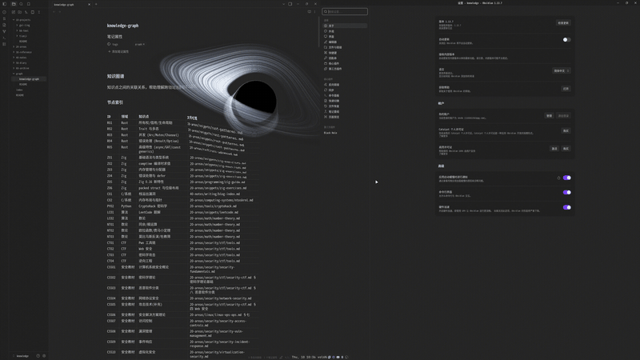

# Obsidian Black Hole

A **gravitational lensing black hole** that floats inside your Obsidian workspace. It
wraps the [ghostty-blackhole](https://github.com/s0xDk/ghostty-blackhole) shader —
Schwarzschild geodesic ray tracing with accretion disk, photon ring, and relativistic
Doppler beaming — as a WebGL2 overlay for Obsidian.



> Demo GIF for this plugin. It uses the same upstream-inspired shader, with
> transparent composition and optional live text lensing.

> Hardware WebGL is required; software rendering is refused. The live text lens is opt-in and requires desktop SVG backdrop-filter support. Real Obsidian acceptance is still pending; verify it in a disposable vault before release.

## What it does

The black hole renders on a **transparent WebGL2 canvas** cropped around the
effect, positioned within your Obsidian window — your notes and UI stay fully visible and clickable, and
the hole floats on top, free to drift anywhere. The canvas is opaque only where
the hole actually is; everywhere else it's transparent. Every pixel near the
hole integrates its own null geodesic through the Schwarzschild metric on the
GPU.

- **Shadow** — rays with impact parameter under `b_crit` spiral through the
  horizon and return black.
- **Text lens** — an optional SVG displacement filter bends the live backdrop
  near the hole. This is an approximate lens, not Ghostty's geodesic text sampling.
- **Accretion disk** — a thin Keplerian disk with blackbody colour from a
  Shakura–Sunyaev temperature profile, shifted and beamed by the relativistic
  factor. The far side arcs over and under the shadow (the _Interstellar_ look).
- **Photon ring** — emergent from rays winding near the `1.5 r_s` photon sphere.
- **Lensed starfield** — faint procedural stars sampled with the bent ray
  direction, so they smear into arcs around the hole.
- **Gravitational time dilation** — the disk's inner orbits visibly freeze as
  the hole grows heavier.

## Default animation and reset

Fresh installs use the upstream 42-second **Demo** tour, so the effect works
without note text or a Claude token signal. The Inferno look and size formula
follow [ghostty-blackhole at b49fa0a](https://github.com/s0xDk/ghostty-blackhole/blob/b49fa0ab2eaf0644a690f4cb386d70c21eb9f969/blackhole.glsl):
hole radius 0.02, disk outer radius 8, token area range 0.01–0.5, with no extra
size attenuation. The upstream default mode itself is Token; this plugin chooses
its self-running Demo for the requested out-of-box animation. The tour intentionally
returns to a small seed every 42 seconds, as upstream does.

Settings → Black Hole → **Reset** restores the animation and performance
parameters, keeps language and the on/off switch, and turns the text lens off.
Old untouched tiny defaults are migrated; customized settings are preserved—use
Reset to switch those to the new showcase.

The overlay is an adaptation, not pixel-identical to Ghostty: it uses transparent
composition, an optional SVG backdrop lens, a pixel budget and 64 rather than
48 integration steps. Normal compositor presentation, deferred resize and stable crop dimensions
avoid blank presentations between draws. Hardware FPS still depends on the GPU.

## Size modes

What drives the hole's growth is selected in settings:

| Mode             | Behaviour                                                                                                                                                                               |
| ---------------- | --------------------------------------------------------------------------------------------------------------------------------------------------------------------------------------- |
| **Pomodoro** (0) | Wall-clock 55/5 work/break cycle. Grows through your work hour, shrinks at break time. Includes a typing detector — stop using the keyboard and the hole fades away.                    |
| **Token** (1)    | Driven by a metric in your vault. Choose from: current note word count, vault-wide word count estimate, file count, or open tab count. The hole grows as your writing / vault fills up. |
| **Demo** (2)     | Self-running 42 s showcase loop that tours 8 visual presets (Inferno → Gargantua → M87\* donut → Face-on ember → Quasar → Blazar → Pure lens → Inferno).                                |

## Install

### From source

```sh
git clone https://github.com/VKKKV/obsidian-blackhole.git
cd obsidian-blackhole
npm install
npm run build
```

Then copy `main.js`, `manifest.json`, and `styles.css` to your vault's
`.obsidian/plugins/obsidian-blackhole/` directory.

### From BRAT

If you use the [BRAT](https://github.com/TfTHacker/obsidian42-brat) plugin, add
`VKKKV/obsidian-blackhole` as a beta plugin.

## Settings

Open Obsidian Settings → Community Plugins → Black Hole. The settings tab gives
you control over every shader tunable:

- **Mode**: Pomodoro / Token / Demo
- **Token metric**: what drives the hole in token mode
- **Hole & lensing**: size, lens depth, starfield brightness
- **Accretion disk**: inner/outer radius, inclination, temperature, opacity,
  Doppler mix, beaming, streak pattern, speed, winding
- **Pomodoro**: work period, break length, idle fade time
- **Performance**: geodesic integration steps (N_STEPS), resolution and text lens
  on/off. Lower resolution reduces WebGL work; sustained overload also reduces
  actual resolution. Software GPUs are not supported.

## No-screenshot architecture

Two local overlays share the effect's position and size. A cropped **WebGL2**
canvas draws the black hole, disk and starfield. An optional **SVG displacement
filter**, applied through CSS `backdrop-filter`, bends the live content behind
the lens. The overlays use `pointer-events: none`; notes stay interactive.

The text lens does not clone notes, take DOM screenshots or upload workspace
images to WebGL. Scrolling and typing update the live backdrop, not a cached
snapshot. No screen capture, recording permission or screen-sharing prompt is
needed. `dom-to-image-more` and old capture tests are legacy diagnostics, not
the current plugin rendering path.

Enable **Text lens** in settings. Its saved key remains `captureEnabled` for
compatibility. The old `captureIntervalMs` setting is unused; there is no capture
interval control.

### Desktop support and cost

The target is desktop Obsidian with hardware WebGL2 and Chromium/Electron support
for SVG filters in `backdrop-filter`. Mobile is not supported. Support varies
with Electron, GPU drivers and compositor behavior. An unsupported lens shows
a short notice; the black-hole effect does not require text lensing.

No screenshots does not mean no GPU cost. The local backdrop filter adds
compositing and displacement work. Large lens areas and high display density
can still stutter. Turn off **Text lens** to remove that extra work. The WebGL
pixel budget below does not cap the browser's backdrop-filter cost. The lens
separately limits its output rectangle to 1,048,576 device pixels by reducing
its reach on large/HiDPI scenes; this is not a bound on compositor time.

This is an approximate screen-space text lens, not Ghostty-equivalent rendering.
Ghostty samples terminal pixels along shader rays; this plugin distorts a live
backdrop separately from its black-hole shader. The upstream GIF is a reference,
not proof of matching appearance. Real Obsidian visual and performance acceptance
remains pending.

The plugin rejects software WebGL before compiling the effect. On hardware it
uses 64 integration steps by default and a cropped canvas with a maximum
2,097,152 backing pixels, at most 4096 per axis. The requested resolution defaults
to 100% of display resolution (device pixel ratio capped at 2). Large windows
respect the pixel cap without shrinking the effect; sustained overload reduces
the actual post-cap resolution, not the saved setting. Existing resolution choices
are preserved; set Resolution to 1 or use Reset for the new full-resolution default.
GPU fences prevent queued frames from accumulating. Reducing integration to 6–10 steps is not a supported performance
mode: it prevents representative rays from reaching the black hole.

## Development

```sh
npm install
npm run dev      # esbuild watch → rebuilds main.js on save (pair with the Hot Reload plugin)
npm run harness  # standalone shader playground at http://localhost:8000 — no Obsidian needed
npm run check    # TypeScript + deterministic regression tests
npm run build -- --outdir=/tmp/blackhole-release  # build without deploying
npm run build    # production build to root main.js; may trigger Hot Reload
```

The **harness** renders the shader over mock "notes" in a plain browser page
with live param sliders, so you can iterate on the shader without launching Obsidian.
The playground explicitly permits software WebGL for testing, unlike the plugin. Its
procedural texture is not a screenshot of the DOM.

A separate `tests/backdrop_electron.cjs` smoke test exercises the lens in an isolated
Electron profile with `electron tests/backdrop_electron.cjs`. The browser scripts require
Python Playwright and a local Chromium executable; set
`CHROMIUM_EXECUTABLE=/absolute/path/to/chrome` when needed. These checks do not
replace acceptance in a real Obsidian vault.

## License

GNU General Public License v3.0. See [LICENSE](LICENSE).

The shader physics is adapted from
[ghostty-blackhole](https://github.com/s0xDk/ghostty-blackhole) by
[s0xDk](https://github.com/s0xDk), which was in turn inspired by
[Eric Bruneton's black hole shader](https://ebruneton.github.io/black_hole_shader/)
(BSD-3-Clause). No code from Bruneton's project is used here — this shader is an
independent screen-space approximation written from scratch.

Shader source: `src/shader.ts` → `makeFS()` generates the complete GLSL with all
tunable consts baked in.
